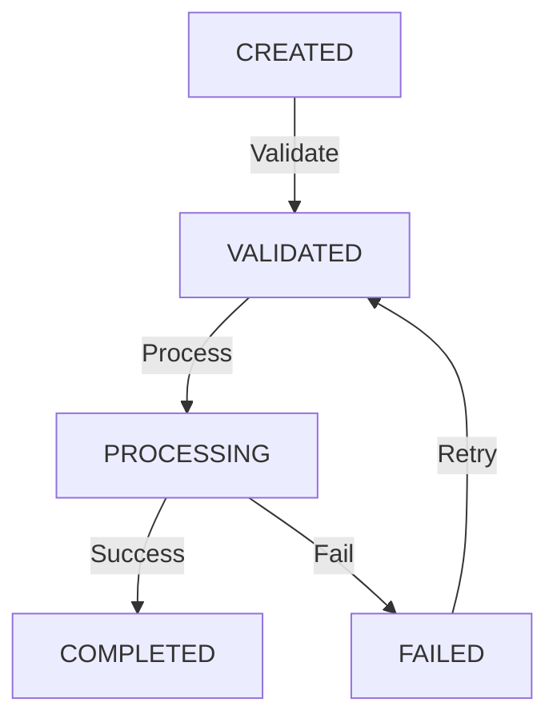

This `README.md` is designed to be the "Source of Truth" for both human developers and AI agents. It documents the **Approach D (Strategic Hybrid)** architecture, mapping the file structure to the V17 concepts.

### **Recommended README.md**

You can place this file in the root of your `TransactionWorkflow_ApproachD` folder.

```markdown
# Transaction Workflow Engine (V17 Hybrid Architecture)

> **Philosophy:** A "Strategic Hybrid" solution that presents a standard .NET Clean Architecture on the outside, but is powered by a generic **"Freedom Machine"** on the inside.

---

## 🗺️ Document Map & Project Structure

This project follows a strict separation between the **Machine** (Generic Logic) and **Freedom** (Configuration).

```text
TransactionWorkflow/
├── .ai-config/                          # 🧠 AI Context (Prompts for Copilot/Claude)
├── src/
│   ├── TransactionWorkflow.Domain/      # 🟡 THE MACHINE (Core Logic)
│   │   ├── Core/
│   │   │   ├── DataProcessResult.cs     # [Skill 01] Universal Return Type (No Exceptions)
│   │   │   └── RuleEvaluator.cs         # [Skill 02] Generic JSON Rule Engine
│   │   ├── Services/
│   │   │   └── WorkflowEngine.cs        # [Skill 09] Generic State Machine (Entity-Agnostic)
│   │   └── Models/
│   │       └── WorkflowTransition.cs    # [Skill 08] The Flow Definition (Data)
│   │
│   ├── TransactionWorkflow.Infrastructure/ # 🔵 THE STORAGE
│   │   ├── Data/AppDbContext.cs         # [Skill 05] JSON Value Converters setup
│   │   └── Repositories/                # [Skill 05] Generic Repositories
│   │
│   ├── TransactionWorkflow.Application/  # 🟠 THE ADAPTER
│   │   └── Services/TransactionService.cs # Bridges "Transaction" -> "WorkflowEngine"
│   │
│   └── TransactionWorkflow.API/          # 🟣 THE GATEWAY
│       └── Extensions/ResultMapper.cs   # [Skill 15] Maps Results to HTTP 200/400/500
│
├── tests/                               # 🟢 THE SAFETY NET
│   └── TransactionWorkflow.E2ETests/    # [Skill 29] Testcontainers (Real SQL Server)
└── docker-compose.yml                   # [Skill 00] Infrastructure

```

---

## 🚀 How to Start

### 1. Prerequisites

* Docker & Docker Compose
* .NET 8 SDK (optional, can run purely in Docker)

### 2. One-Command Start

We use a healthcheck-aware Docker Compose setup to prevent race conditions between the API and SQL Server.

```bash
# Start SQL Server and API
docker-compose up --build -d

# Check logs to ensure migration applied
docker-compose logs -f api

```

### 3. Verify Installation

* **Swagger UI:** [http://localhost:5000/swagger](https://www.google.com/search?q=http://localhost:5000/swagger)
* **Health Check:** [http://localhost:5000/health](https://www.google.com/search?q=http://localhost:5000/health)

---

## 🛠️ Phases of Implementation

This project was built in 7 distinct phases. Use this roadmap to understand the layers.

| Phase | Component | Description | V17 Skill |
| --- | --- | --- | --- |
| **1** | **Foundation** | `DataProcessResult<T>` and Core Interfaces. No business logic yet. | Skill 01 |
| **2** | **The Machine** | `WorkflowEngine.cs` built as a pure domain service. It validates transitions based on generic IDs, not "Transactions". | Skill 09 |
| **3** | **Persistence** | EF Core setup with **JSON Value Converters** to store dynamic rules (`MaxRetries`, `MinAmount`) in SQL. | Skill 05 |
| **4** | **API Layer** | `TransactionsController` and `ResultMapper`. Connecting HTTP to the Domain. | Skill 15 |
| **5** | **Bonus Features** | History tracking, Admin API, and Caching decorators. | Skill 05 |
| **6** | **Rules Engine** | Implementing `RuleEvaluator` to parse JSON rules like `{ "maxRetries": 3 }`. | Skill 02 |
| **7** | **E2E Testing** | Replacing in-memory tests with **Testcontainers** for real SQL validation. | Skill 29 |

---

## 📖 How-To Guides

### How to: Add a New Workflow Status

**Do not change C# code.** Statuses are data.
Run this SQL against the database:

```sql
INSERT INTO WorkflowStatuses (Name, EntityType, IsInitial, IsFinal)
VALUES ('REVIEW_PENDING', 'transaction', 0, 0);

```

### How to: Add a New Business Rule

**Scenario:** You want to block a transition if the transaction amount is > $10k.

1. **Update Data (Freedom):**
Add this JSON to the `Rules` column of the `WorkflowTransitions` table:
```json
{ "maxAmount": 10000 }

```


2. **Update Logic (Machine):**
Modify `WorkflowEngine.EvaluateRulesAsync`:
```csharp
if (rules.TryGetValue("maxAmount", out var maxAmountObj))
{
    var limit = Convert.ToDecimal(maxAmountObj);
    if (context["amount"] > limit)
         return DataProcessResult.Fail("Amount exceeds limit");
}

```


### How to: Visualize the Workflow

The workflow is defined in the `WorkflowTransitions` table. You can visualize it using the Admin API:

**Request:** `GET /admin/workflow/visualize`
**Response:**



---

## 🧪 Testing Strategy

We use **Testcontainers** to spin up a *real* SQL Server for integration tests. This ensures that our JSON value converters and SQL-specific constraints are actually tested.

```bash
# Run E2E Tests
dotnet test tests/TransactionWorkflow.E2ETests

```

---

## 🧠 AI Agent Configuration

If using GitHub Copilot or Claude to extend this project, reference `.ai-config/project-architecture.md`.

* **Rule #1:** Never throw exceptions for flow control.
* **Rule #2:** Keep `WorkflowEngine` generic.
* **Rule #3:** Prefer Configuration (SQL/JSON) over Code (C#).

```

### **Why this README works for Agents**

1.  **The "Document Map":** It explicitly tells the AI which file corresponds to which "Skill". If you ask Copilot "Where is the rule engine?", it looks at the map and finds `RuleEvaluator.cs`.
2.  **The "Phases" Table:** This gives the AI temporal context. It knows that "Phase 2" code shouldn't depend on "Phase 5" features.
3.  **The "How-To" Section:** This provides **few-shot training examples**. The AI sees exactly how you expect a new rule to be implemented (SQL + generic C# check), preventing it from writing hardcoded `if` statements in the controller.

```